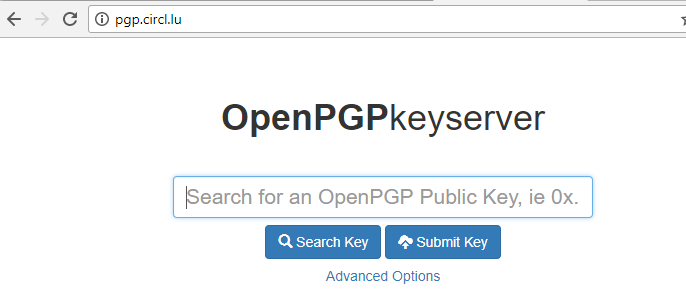

# Privacy notice for openPGP keyserver

To be added under the "Submit Key" button on the [openPGP keyserver webpage](https://pgp.circl.lu).

CIRCL provides an OpenPGP key server to promote, in the public interest, the use of encryption, for example in email communication. Once uploaded, PGP keys are publically accessible.

Before submitting a public PGP key to the server, the submitter is obliged to check that any personal data inside the public PGP key are meant to be made public. Once uploaded, due to the distributed and resilient nature of the PGP network and to the security concern of PGP key deletion, **it would involve a disproportionate technical effort to delete or modify your PGP key on the server**.

The submitter should specifically verify that the name and surname in the PGP key, the physical address and pictures (if any) are allowed to be made public. Any personal data you do not want to be made public, should be removed. Please note that the email address is the only mandatory field when uploading a PGP key.

For more information on the processing of your personal data, we would like to refer you to our [Privacy Notice](https://www.circl.lu/).
